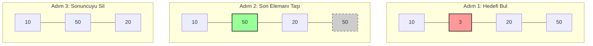

# Insert Delete GetRandom O(1) - LeetCode 380
Bu soru  özelinde adım adım nasıl bir çözüm geliştirdiğimi ve karşılaştığım zorlukları paylaşmak istiyorum.
## Amaç
Bu soruda; eleman ekleme, silme ve rastgele bir eleman getirme (`getRandom`) işlemlerinin hepsini **O(1)** yani sabit sürede yapan bir sınıf tasarlanması isteniyor.

## Çözüm Süreci ve Karşılaştığım Engeller

Bu problemi çözerken aklıma gelen ilk yöntemden nihai çözüme nasıl ulaştığımı paylaşmak isterim.

### 1. Neden Sadece HashSet Yetmedi?
Probleme başladığımda düşündüğüm ilk şey soru bizden  O(1) zamanında ekleme ve çıkarma işlemleri yapmamızı istediği için `HashSet` kullanmaktı.
* **Sorun:** `getRandom()` fonksiyonuna geldiğimde tıkandım. Set içindeki elemanlara index ile erişemediğim için iterator kullanmam gerekecekti ve bu da O(N) zaman alacaktı.

### 2. HashMap ve Index Sorunsalı
Madem index lazım, o zaman elemanları `HashMap` içinde `(Index -> Value)` şeklinde tutmayı düşündüm.
* **Sorun:** Rastgele bir sayı üretip o key'e erişebilirdim ama aradan bir eleman sildiğimde indexlerde boşluk oluşuyordu. Bu boşluklar `getRandom()` metodunda mapte olmayan bir indexe denk gelme ihtimalini doğuracaktı. Map'in bütün anahtarlarını yeniden düzenlemek (re-indexing) gerekecekti ve bu da O(1) kuralını ihlal edecekti.

### 3. LinkedList mi ArrayList mi?
İndeksleri düzgün tutmak için bir List yapısına ihtiyacım olduğunu düşündüm. Peki hangi liste?
* **LinkedList:** Silme işlemi hızlı olsa da "bana 5. elemanı ver" dediğimde tek tek sayarak gittiği için `getRandom` yavaşlıyor (O(N)).
* **ArrayList:** `get(index)` işlemi O(1), yani `getRandom` için harika. Ama asıl sorun şuydu: ArrayList'ten eleman sildiğimizde, listedeki bütün elemanların indexi değişiyor. Bütün listeyi yeniden indexlemek O(N) maaliyeti olacağından listedeki elemanların indexlerini değiştirmeden silme işlemi yapmam gerekiyordu.

### 4. Çözümün Kilit Noktası: Swap & Pop
Düşündüğümüz zaman aslında listenin sıralı olmasının hiçbir önemi yok. O zaman neden silme işlemi için listenin sonundaki elemanı kullanmıyoruz? Bu sayede liste yeniden indexlenmek zorunda kalmaz ve silme işlemi O(1) olur.

Eğer listeden `3`'ü silmek istiyorsam ve `3` listenin ortasındaysa:
1.  Listenin **en sonundaki** elemanı alıp, silmek istediğim `3`'ün üzerine yazarım.
2.  Böylece aradaki boşluk dolmuş olur.
3.  Sonra listenin sonundaki (zaten kopyaladığım) fazlalık elemanı silerim (`removeLast`).

Bu yöntemle listenin geri kalanına dokunmadan, sadece son elemanla işlem yaparak silmeyi O(1)'e indirdim.

Listemiz `[10, 3, 20, 50]` olsun ve biz **3**'ü silmek isteyelim.


### 5. Map Senkronizasyonu
Listede yaptığımız bu yer değişikliğini (`Swap`) Map'e de haber vermemiz gerekiyor. Aksi takdirde Map, taşıdığımız son elemanın hala eski yerinde olduğunu sanar.

İşlem sırası şöyle olmalı:
1.  **Hedefi Bul:** Silinecek `3`'ün indexini Map'ten al (Örn: index 1).
2.  **Son Elemanı Al:** Listenin sonundaki `50`'yi al.
3.  **Listeyi Güncelle:** Listenin 1. indexine `50`'yi yaz.
4.  **Map'i Güncelle:** Map'e gidip "Artık 50 değeri, 1. indexte duruyor" diyerek güncelleme yap (`map.put(50, 1)`). 
5.  **Temizlik:** Son olarak `3`'ü Map'ten sil ve listedeki son elemanı uçur.

## Çözüm

```java
class RandomizedSet {
    private Map<Integer, Integer> map;
    private List<Integer> list;
    private Random random;

    public RandomizedSet() {
        this.map = new HashMap<>();
        this.list = new ArrayList<>();
        this.random = new Random();
    }

    public boolean insert(int val) {
        if (map.containsKey(val)) {
            return false;
        }
        map.put(val, list.size());
        list.add(val);
        return true;
    }

    public boolean remove(int val) {
        if (!map.containsKey(val)) {
            return false;
        }

        // 1. Gerekli verileri al
        int index = map.get(val); // Silinecek elemanın yeri
        int lastElement = list.get(list.size() - 1); // Yerine geçecek eleman

        // 2. Listenin son elemanını, silinecek elemanın yerine kopyala (Swap)
        list.set(index, lastElement);
        
        // 3. Map'i güncelle: Son elemanın yeni adresini bildir
        map.put(lastElement, index);
        
        // 4. Temizlik: Fazlalık son elemanı ve silinecek değeri uçur
        list.remove(list.size() - 1);
        map.remove(val);

        return true;
    }

    public int getRandom() {
        return list.get(random.nextInt(list.size()));
    }
}